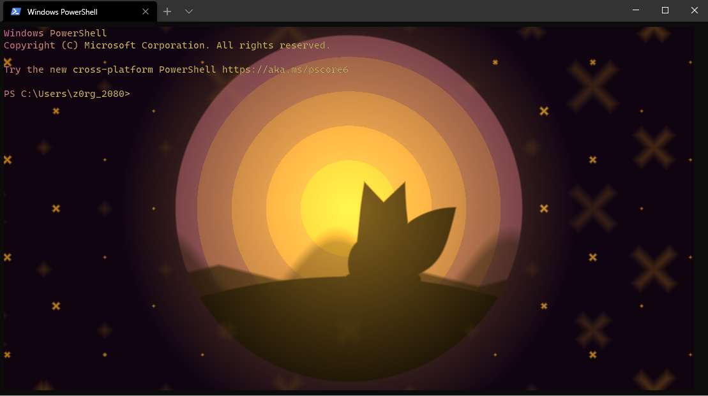

# Shaders for the new windows terminal
## How to use it
* Download and install Windows terminal https://www.microsoft.com/en-us/p/windows-terminal/9n0dx20hk701?activetab=pivot:overviewtab
* Clone the repository at a convenient place
* Change the windows terminal settings and add the following to the settings file
```jsonc
{
  "profiles": {
    "defaults": {
      // Put settings here that you want to apply to all profiles.
      "experimental.pixelShaderPath": "C:\\WindowsTerminalShaders\\Fox.hlsl"
    },
  }
```

## What is available
* Fox shader

*Solar System shader

* Stars shader
